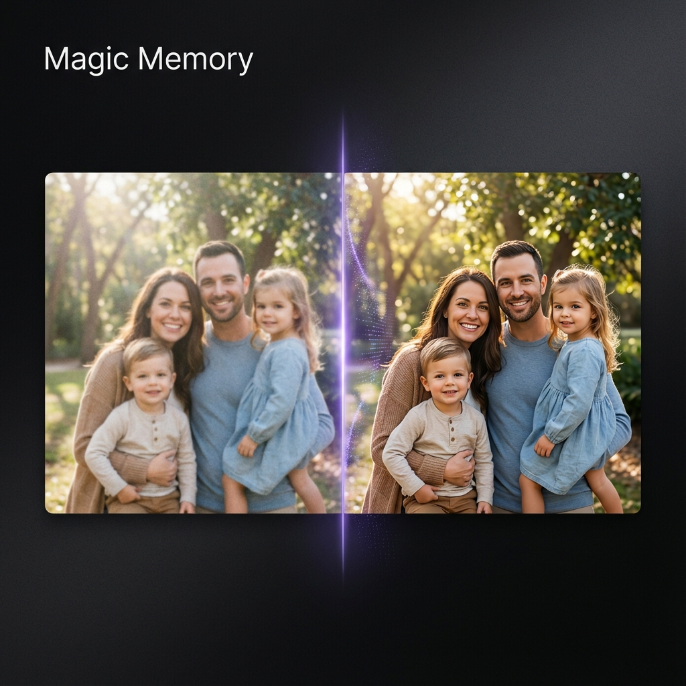

<div align="center">

<h1>✨ Magic Memory ✨</h1>

[](https://nextjs.org/)
[](https://react.dev/)
[](https://www.typescriptlang.org/)
[](https://tailwindcss.com/)
[](https://ui.shadcn.com/)
[](https://replicate.com)
[](https://pnpm.io/)
[](https://github.com/thaka/magic-memory/actions/workflows/ci.yml)
[](LICENSE)
[](https://github.com/thaka/magic-memory/stargazers)
[](CONTRIBUTING.md)

[](https://vercel.com/new/clone?repository-url=https%3A%2F%2Fgithub.com%2Fthaka%2Fmagic-memory)

<p>AI-powered photo restoration SaaS that revives old, blurry, or damaged photos in seconds.</p>

[Report Bug](https://github.com/thaka/magic-memory/issues/new?template=bug_report.md) · [Request Feature](https://github.com/thaka/magic-memory/issues/new?template=feature_request.md)

</div>

---

## What It Does

- Restores old, blurry, or damaged photos with GFPGAN on Replicate.
- Client-side NSFW detection blocks unsafe uploads before they hit the server.
- Credit system with daily free credit plus paid packs that never expire.
- Real-time job status, interactive before/after slider, and downloadable results.
- Authentication with Clerk; payments via Stripe; storage on Supabase.

## Why It’s Useful

- Reliable quality: GFPGAN restores facial detail and clarity automatically.
- Fast path to production: App Router, server-first patterns, and SWR for data.
- Safe by default: NSFW prefiltering and rate limiting via Upstash Redis.
- Clear pricing: free daily credit to try, paid credits that stay in your account.

## 📸 Screenshots

<div align="center">
  
</div>

## Tech stack

| Category         | Technology                      |
| ---------------- | ------------------------------- |
| Framework        | Next.js 15 (App Router)         |
| Language         | TypeScript (strict)             |
| Styling          | Tailwind CSS 4 + shadcn/ui      |
| Auth             | Clerk                           |
| Database/Storage | Supabase (PostgreSQL + Storage) |
| AI               | GFPGAN on Replicate             |
| Rate limiting    | Upstash Redis                   |
| Payments         | Stripe                          |
| Logging          | Pino                            |
| Data fetching    | SWR                             |
| Validation       | Zod                             |

## Getting Started

### Prerequisites

- Node.js 20+
- pnpm
- Accounts: Clerk, Supabase, Stripe, Replicate, Upstash

### Setup

```bash
git clone https://github.com/thaka/magic-memory.git
cd magic-memory
pnpm install
cp .env.example .env.local
# add Clerk, Supabase, Stripe, Replicate, Upstash keys
```

### Database

Run the SQL scripts in `scripts/` (in order):

- `scripts/001_create_users_table.sql`
- `scripts/002_create_restorations_table.sql`
- `scripts/003_create_purchases_table.sql`
- `scripts/004_create_atomic_credit_functions.sql`

### Run locally

```bash
pnpm dev
# visit http://localhost:3000
```

## Useful scripts

| Command              | Purpose                                |
| -------------------- | -------------------------------------- |
| `pnpm dev`           | Start dev server with hot reload       |
| `pnpm lint`          | ESLint quality gate                    |
| `pnpm type-check`    | TypeScript check without emit          |
| `pnpm test:run`      | Run Vitest in CI mode                  |
| `pnpm build`         | Production build (includes type-check) |
| `pnpm start`         | Start production server after build    |
| `pnpm run seo:audit` | SEO audit script                       |

Pre-commit: run `pnpm lint` and `pnpm type-check`.

## Testing

- `pnpm type-check` — TypeScript validation without emit.
- `pnpm test:run` — Run the Vitest suite used in CI.

## Deployment

- One-click: use the Vercel button above (defaults to `next build` output). Add all required environment variables (Clerk, Supabase, Stripe, Replicate, Upstash) in the Vercel dashboard.
- Manual: `pnpm build` then `pnpm start` on Node 20+. Ensure your host provides the same environment variables and Supabase/Redis endpoints.

## Project structure

```
magic-memory/
├── app/                # Next.js App Router pages and APIs
├── components/         # UI and feature components
├── lib/                # Supabase clients, Redis, logger, validations
├── scripts/            # Database migrations and SEO audit
├── __tests__/          # Vitest coverage for APIs and libs
└── .github/            # CI, issue/PR templates, funding
```

## Architecture at a glance

- **App Router** pages under `app/`; API routes live in `app/api/`.
- **Auth** via Clerk middleware in `proxy.ts`; protected routes include `/restore` and `/profile`.
- **Credits** tracked in Supabase with RPC functions; free daily credit resets and paid credits never expire.
- **Storage** uses Supabase Storage; rate limiting via Upstash Redis.
- **AI restore** calls Replicate GFPGAN; results stored and returned to the user.
- **Logging** with Pino; validations via Zod.

## CI

GitHub Actions (`.github/workflows/ci.yml`) runs pnpm lint, type-check, tests, and build on Node 20 and 22. Secrets are stubbed with safe placeholders.

## Contributing

We welcome contributions. Read the [Contributing Guide](CONTRIBUTING.md) and follow the [Code of Conduct](CODE_OF_CONDUCT.md). Use the issue templates for bugs and feature requests, and the PR template when submitting changes.

## Security

Report vulnerabilities privately as described in [SECURITY.md](SECURITY.md). Do not open public issues for security reports.

## Funding

Support the project: [Buy Me a Coffee](https://buymeacoffee.com/thaka).

## License

Apache License 2.0. See [LICENSE](LICENSE).

## Acknowledgments

- [GFPGAN](https://github.com/TencentARC/GFPGAN)
- [Replicate](https://replicate.com)
- [shadcn/ui](https://ui.shadcn.com)
- [Vercel](https://vercel.com)
